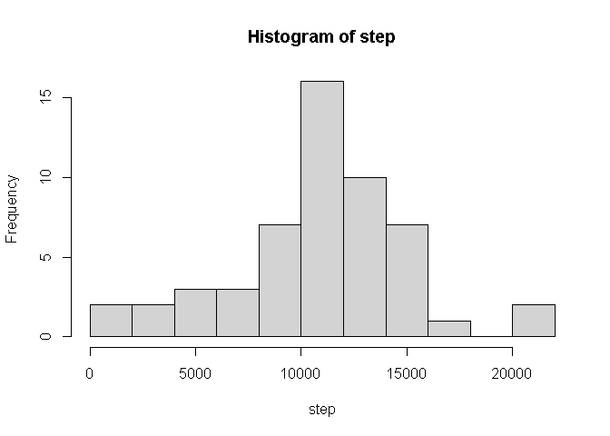
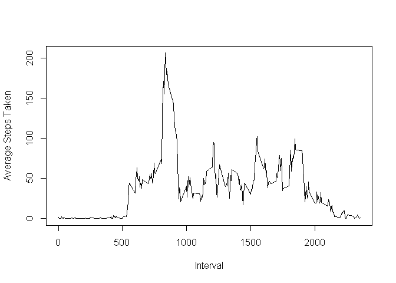
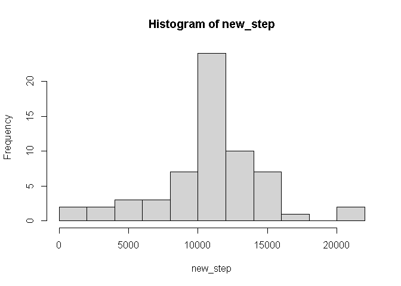
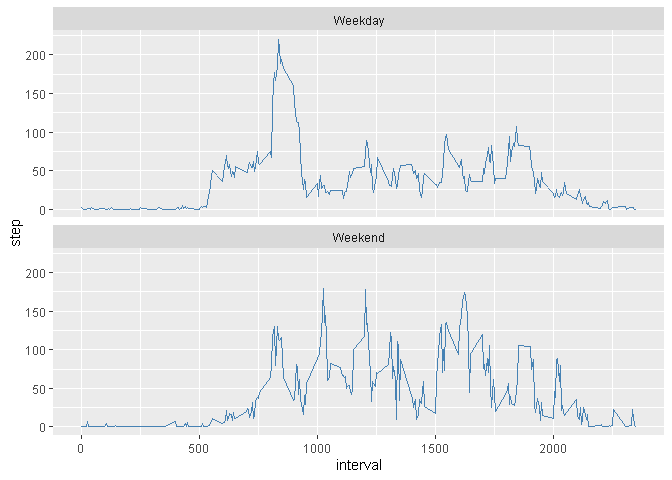

## Loading and preprocessing the data

```r
data <- read.csv("activity.csv")
data$date <- as.Date(data$date, format = "%Y-%m-%d")
```
## What is mean total number of steps taken per day?

```r
step <- with(data, tapply(steps, date, sum))
hist(step, breaks = 10)
```

<!-- -->

```r
print(paste0("Mean : ", as.character(mean(step, na.rm = TRUE))))
```

```
## [1] "Mean : 10766.1886792453"
```

```r
print(paste0("Median : ", as.character(median(step, na.rm = TRUE))))
```

```
## [1] "Median : 10765"
```
## What is the average daily activity pattern?

```r
intrvl <- with(data, tapply(steps, interval, mean, na.rm = TRUE))
plot(names(intrvl),intrvl, type = "l", xlab = "Interval", ylab = "Average Steps Taken")
```

<!-- -->

```r
print(paste0("The inteval with maximum number of steps is ",names(intrvl)[which.max(intrvl)]))
```

```
## [1] "The inteval with maximum number of steps is 835"
```

## Imputing missing values

**The missing values have been replaced by the mean of 5-min interval.**


```r
sum(is.na(data))
```

```
## [1] 2304
```

```r
tmp = intrvl[as.character(data$interval[is.na(data)])]
step_tot <- data$steps
step_tot[is.na(step_tot)] = tmp
new_data <- data.frame(steps = step_tot, date = data$date,interval =  data$interval)
new_step <- with(new_data, tapply(steps, date, sum, na.rm = TRUE))
hist(new_step, breaks = 10)
```

<!-- -->

Filling of missing values have lead to an increase in the frequency of steps taken every day

## Are there differences in activity patterns between weekdays and weekends?

```r
weekday <- as.factor(weekdays(data$date) == "Sunday")
library(plyr)
weekday <- revalue(weekday, c("TRUE" = "weekend", "FALSE" = "weekday"))
new_data$week <- weekday
weekday_data <- with(subset(new_data, week == "weekday"), tapply(steps, interval, mean))
weekend_data <- with(subset(new_data, week == "weekend"), tapply(steps, interval, mean))
final <- data.frame(step = c(weekday_data, weekend_data), interval = rep(as.numeric(names(weekday_data))), fact = rep(c("Weekday", "Weekend"),each = 288))
library(ggplot2)
g <- ggplot(final, aes(interval, step))
g + geom_line(color = "steelblue") + facet_wrap(~fact, dir = "v")
```

<!-- -->
